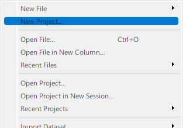
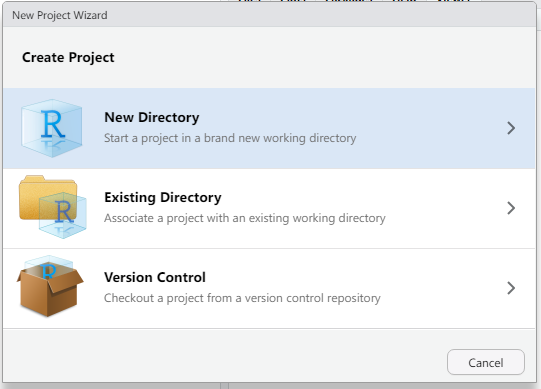
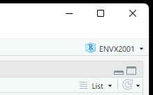
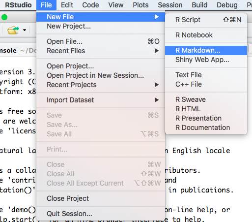
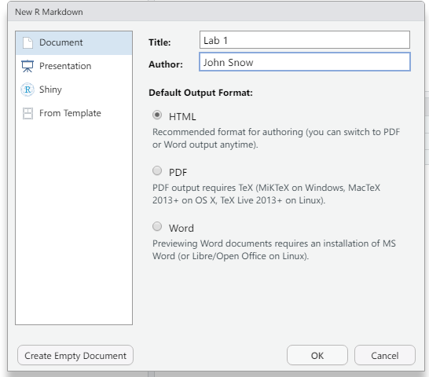
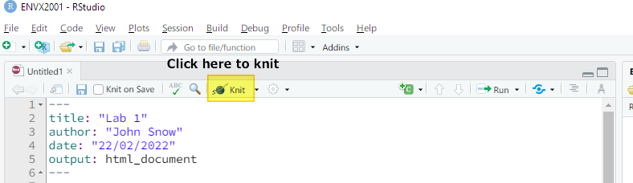
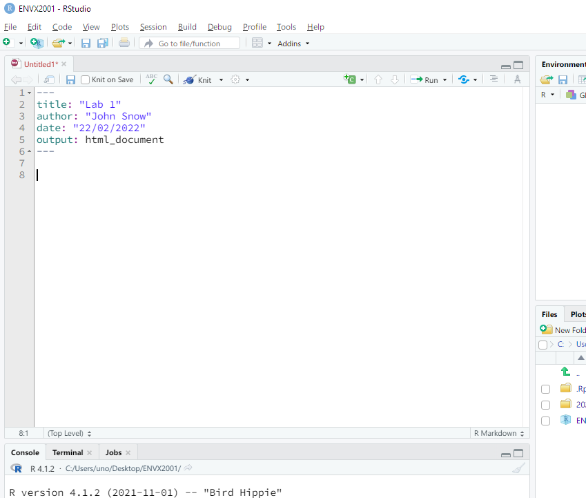

```{r setup, include=FALSE}
library(learnr)
knitr::opts_chunk$set(echo = FALSE)
```


## Welcome
### Outline


Welcome to Tutorial 1. In this tutorial we will show you how to:

1. Set up a project in RStudio;
2. Create and R Markdown file on RStudio; and
3. Work with data in R


## Setting up a project in RStudio

Organise yourself for ENVX2001 by creating an ENVX2001 project (`.Rproj` extension). Follow the steps below to create this file so that RStudio recognises your working folder.

### Step 1

Select `File` > `New Project...` from the menu bar that is at the top of your screen (macOS) or the top of the RStudio windows (PC/Linux).




### Step 2

Create project by selecting a `New Directory`. You may also use an `Existing Directory` if you know what you are doing.



### Step 3

In the next window, set `Directory name` to "ENVX2001" or similar, and click on `Browse` to select the folder where this folder will reside, e.g. the Desktop. Click on `Create Project` when ready.


### Step 4

Verify that the project is created by looking at the top right corner of RStudio. If you see your project name i.e. "ENVX2001", RStudio has recognised that 



### Why did I create a project?

1. You have basically created a file, `ENVX2001.Rproj`, which now resides in the folder "ENVX2001".
2. When you open this file, RStudio will set the **working directory** to the folder that contains this `.Rproj` file.
3. We can import data easily when the working directory is identified. [See this link for more details](https://support.rstudio.com/hc/en-us/articles/200526207-Using-RStudio-Projects).

**It is recommended that you open the `.Rproj` file every time you work in the Labs, as it will make all data import code reproducible.**


## R Markdown 

ENVX2001 uses R Markdown extensively. At every Lab, you are expected to **create your own R Markdown file** to complete the Lab exercises. This section will quickly show you **how to create the document for your first Lab** in RStudio.


### Step 1

Click on `File` > `New File` > `R Markdown...` from the menu bar that is at the top of your screen (macOS) or the top of the RStudio windows (PC/Linux).



### Step 2

Make sure that "HTML" is selected as the Default Output Format. You may change the Title and Author, but it can also be edited later. Click OK.




### Step 3

Knit the file once the document is generated. This can be done by clicking on the Knit button, or by using the hotkey `cmd + shift + k` (macOS) or `ctrl + shift + k`. RStudio will prompt you to save the file. Give it a name (e.g. `Lab1`) and save it. The HTML document will preview automatically.

*Note: if you are still in the ENVX2001 project, your file will automatically be saved in the working directory.*




### Step 4

Remove unnecessary text from the template by highlighting all the filler text and deleting them. The file is now ready for Lab 1.




## That's it!

This concludes this week's tutorial.