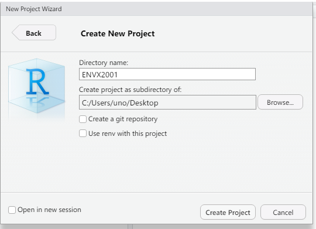

```{r setup, include=FALSE}
library(learnr)
knitr::opts_chunk$set(echo = FALSE)
```

## Introduction

**Welcome to Tutorial 1**. Tutorials in ENVX2001 are **self-study** and designed to complement your Labs. **Make sure to complete each week's tutorial before you attend your Lab**.

Most tutorials will be accompanied by video(s), except for *this* tutorial. Instead, we have developed a series of videos available on [**Canvas**](https://canvas.sydney.edu.au/) which are meant to refresh your memory on R and RStudio, or show you how to get started if you are new.

To access these videos, on the ENVX2001 page, find **Week 1: Introduction** from the Modules sidebar, and click on **Week 1 Getting Started**.

### Outline

In this tutorial we will show you how to:

1.  Create an RStudio Project for ENVX2001.
2.  Create an R Markdown file used to write reports and documentation.
3.  Import data files from Excel and CSV into R.

Click **Next Topic** to continue.

## Setting up an RStudio Project

It's *great* to be organised when working with a lot of files, and RStudio helps you do that by the way of [Projects](https://support.posit.co/hc/en-us/articles/200526207-Using-RStudio-Projects). Organise yourself for ENVX2001 by creating a Project file. The steps below describe how to create one -- start by opening your RStudio app.

### Step 1

Select `File` \> `New Project...` from the menu bar that is at the top of your screen (macOS) or the top of the RStudio windows (PC/Linux).

{width="400"}

### Step 2

Create project by selecting a `New Directory`. Note: you may also use an `Existing Directory` if you already have an ENVX2001 folder.

{width="480"}

### Step 3

In the next window, set `Directory name` to "ENVX2001" or similar, and click on `Browse` to select the folder where this folder will reside, e.g. the Desktop. Click on `Create Project` when ready.

{width="480"}

### Step 4

Verify that the project is created by looking at the top right corner of RStudio. If you see your project name i.e. "ENVX2001", the project is active. 

{width="600"}

### Why did I create a project?

1.  You have basically created a file, `ENVX2001.Rproj`, which now resides in the folder "ENVX2001".
2.  When you open this file, RStudio will set the **working directory** to the folder that contains this `.Rproj` file.
3.  We can import data easily when the working directory is identified. [See this link for more details](https://support.rstudio.com/hc/en-us/articles/200526207-Using-RStudio-Projects).

**It is recommended that you open the `.Rproj` file every time you work in the Labs, as it will make all data import code reproducible.**

### Done!

Click **Next Topic** to move on to the next part of the Tutorial.


## R Markdown

ENVX2001 uses R Markdown extensively. At every Lab, you are expected to **create your own R Markdown file** to complete the Lab exercises. This section will quickly show you **how to create the document for your first Lab** in RStudio.

:::{.alert .alert-info}
The next-generation publishing system used in RStudio is [**Quarto**](https://quarto.org) and you may follow similar instruction to create a Quarto Document. 

To ensure backward compatibility (not everyone will meet the minimum requirements of Quarto) we will continue to use R Markdown throughout this unit.
:::

### Step 1

Click on `File` \> `New File` \> `R Markdown...` from the menu bar that is at the top of your screen (macOS) or the top of the RStudio windows (PC/Linux).

{width="550"}

### Step 2

Make sure that "HTML" is selected as the Default Output Format. You may change the Title and Author, but it can also be edited later. Click OK.

{width="450"}

### Step 3

Knit the file once the document is generated. This can be done by clicking on the Knit button, or by using the hotkey `cmd + shift + k` (macOS) or `ctrl + shift + k`. **RStudio will prompt you to save the file**. Give it a name (e.g. `Lab_01`) and save it. The HTML document will preview automatically.

*Note: if you are still in the ENVX2001 project, your file will automatically be saved in the working directory.*

{width="500"}

### Step 4

Remove unnecessary text from the template by highlighting all the filler text and deleting them. The file is now ready for Lab 1.

{width="500"}


### Review

Finally, below is a GIF on what we just did. Click on **Next Topic** when you are ready.

{width="800"}

## Final Remarks

... we are done! This concludes this week's tutorial. 
